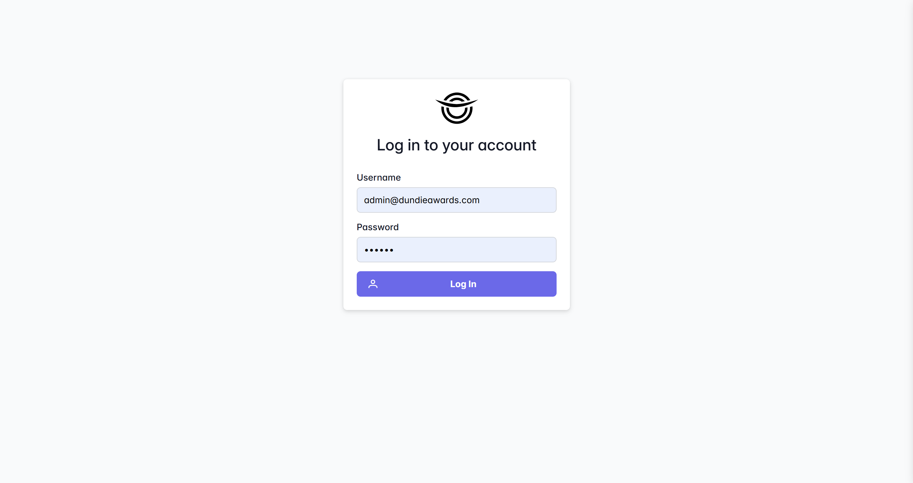
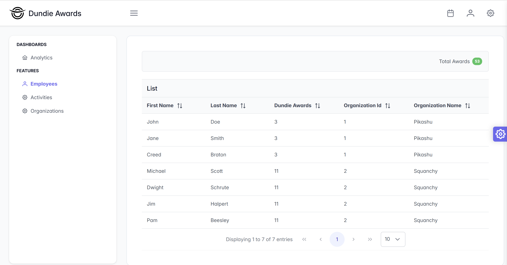
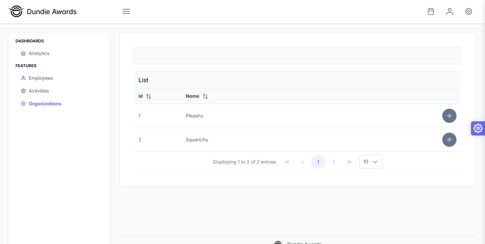
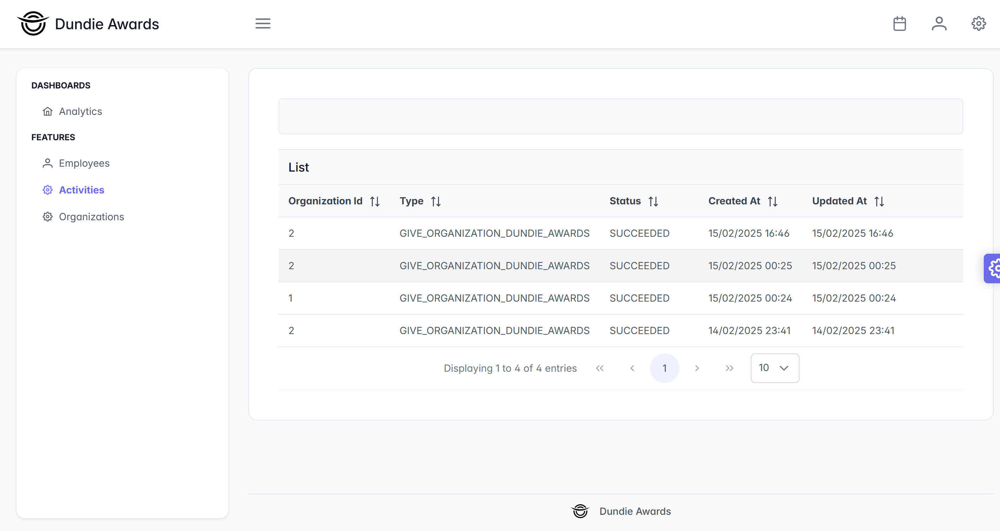
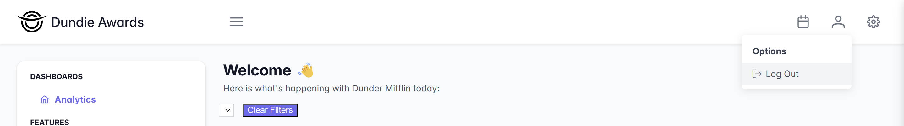

# Dundie Awards Project

## Overview
The **Dundie Awards Project** is a modular, event-driven application designed for managing employee awards within organizations. The backend leverages a microservices architecture with robust messaging, authentication, and persistence mechanisms.

## Features
- **Event-Driven Messaging**: Uses **RabbitMQ** for asynchronous event-driven communication between services.
- **Caching**: Implements **Redis** for improved performance and session management.
- **Authentication**: Utilizes **Distributed JWT Tokens** for secure authentication across services.
- **Database & Migrations**:
    - Uses **PostgreSQL** for data storage.
    - Supports **Flyway** for database versioning and migrations.
- **Resilience**:
    - Implements rollback mechanisms in case of transaction failures.
    - Uses backoff strategies for handling failed event deliveries.
- **Frontend**:
    - Developed in **Angular** to provide a clean and responsive UI.
    - Decoupled from the SSR backend to improve scalability and maintainability.
    - Provides functionalities for listing employees, activities, and organizations.
    - Enables adding awards to organizations.

## Project Structure
```
/dundie-awards
│── activity-module          # Handles activity-related logic
│── auth-module              # Authentication and authorization
│── common-module            # Shared utilities and models
│── frontend-module          # Angular application for UI
│── messaging-module         # RabbitMQ integration for event-driven messaging
│── organization-module      # Organization-related operations
│── gradle                   # Gradle build scripts
│── .gitignore               # Git ignore rules
│── build.gradle             # Gradle build configuration
│── gradlew                  # Gradle wrapper (Unix)
│── gradlew.bat              # Gradle wrapper (Windows)
│── settings.gradle          # Gradle settings
```

## Getting Started

### Prerequisites
Ensure you have the following installed:
- **Java 17+** (for backend services)
- **Node.js & Angular CLI** (for frontend development)
- **Docker & Docker Compose** (for running services locally)
- **Gradle** (for building the backend)

### Setup
1. Clone the repository:
   ```sh
   git clone https://github.com/aplanos/dundie-awards.git
   cd dundie-awards
   ```

2. Start required services (RabbitMQ, Redis, PostgreSQL) using Docker:
   ```sh
   cd .\organization-module\
   docker-compose up -d
   ```

3. Build and run the organization module:
   ```sh
   cd .\organization-module\
   ./gradlew build
   ./gradlew bootRun
   ```
   
4. Build and run the auth module:
   ```sh
   cd .\auth-module\
   ./gradlew build
   ./gradlew bootRun
   ```
   
5. Build and run the activity module:
   ```sh
   cd .\activity-module\
   ./gradlew build
   ./gradlew bootRun
   ```

6. Navigate to the frontend module and start the UI:
   ```sh
   cd frontend-module
   npm install
   npm start
   ```

### Accessing the Application

- Frontend UI: Accessible at http://localhost:4200

- Organization Module API (Swagger UI): Accessible at http://localhost:8080/swagger-ui/index.html

- Activity Module API (Swagger UI): Accessible at http://localhost:8081/swagger-ui/index.html

- Auth Module API (Swagger UI): Accessible at http://localhost:8082/swagger-ui/index.html

- RabbitMQ Management UI: Accessible at http://localhost:15672 (credentials: guest/guest)

## Queues and Dead Letter Queue (DLQ) Definitions

All the following queues can be accessed at the rabbitMq Console portal using the url: http://localhost:15672/#/queues 
Login using the credentials guest/guest

### activity-create-queue
- Handles messages related to the creation of activities.
- Ensures that activity-related events are processed asynchronously and reliably.
### activity-rollback-queue
- Responsible for processing rollback events for activities.
- Used when an operation needs to be reverted due to an error or inconsistency.
- activity-rollback-queue_dlq 
### Dead Letter Queue (DLQ) for activity-rollback-queue.
- Stores messages that failed processing after multiple retry attempts.
- Helps in debugging and identifying recurring failures in rollback operations.
### give-awards-queue
- Manages messages related to awarding users or entities.
- Ensures that the awarding process is handled asynchronously to improve system performance.

## Application UI

## Login
- URL: http://localhost:4200/login
- User: admin@dundieawards.com 
- Password: 123456



## Employees
- URL: http://localhost:4200/employee
- This view allow to see all the organizations employees and the current total awards


## Organizations
- URL: http://localhost:4200/organization
- This view allow to see all the organizations and start the async process of giving awards
- Click the (+) button to start the giving awards process



## Activities
- URL: http://localhost:4200/activity
- This view allow to see all the activities generated by the giving awards process



## LogOut
- User can always logout by clicking the option in the top navigation menu

